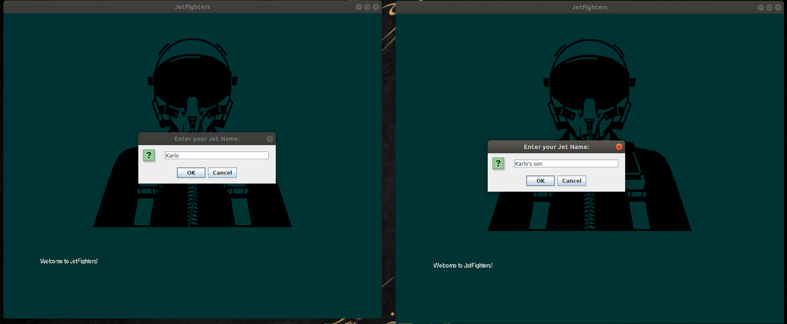
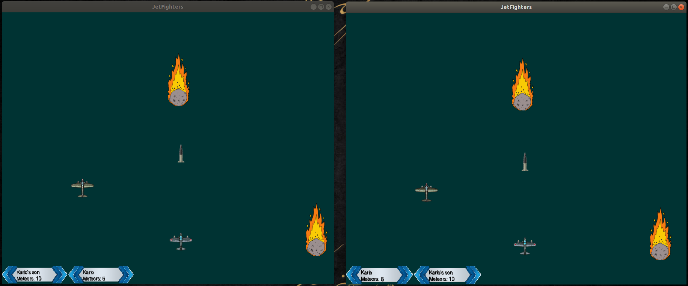
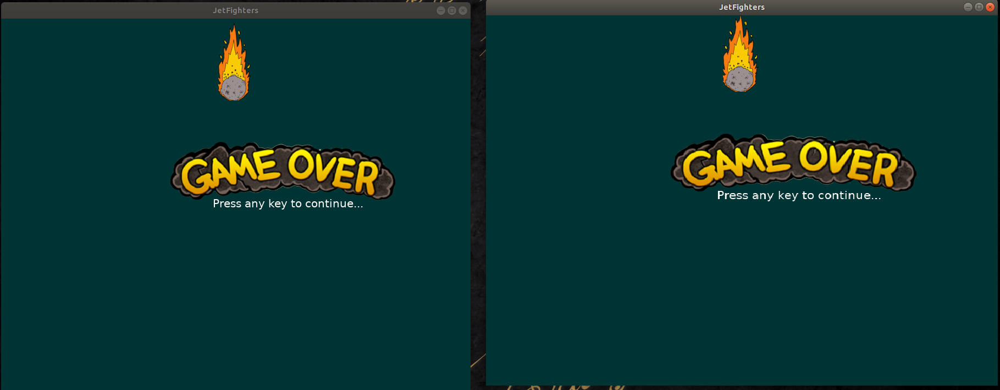

# jetfighters #

jetfighers is a simple air-fighting game for 1, 2, 3 or even more players.
Game was developed for me and my son to have a cool multiplayer game we were able to play cooperative from different PCs.
The point is to destroy as many meteors you can, competing against other players or helping them out when they don't see a meteor coming :)

Game itself was created using libGDX and a server is Netty based UDP.

# Actual screenshots #

** Login screen **

** Action! **

** And that's it **

